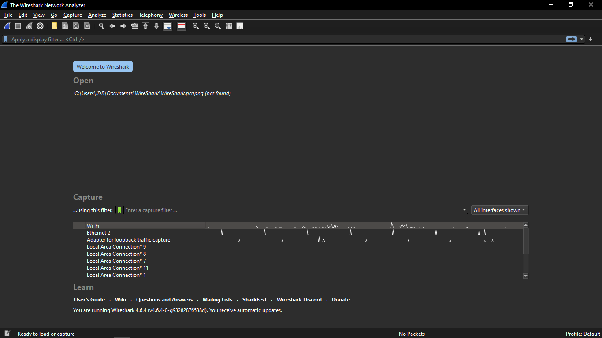
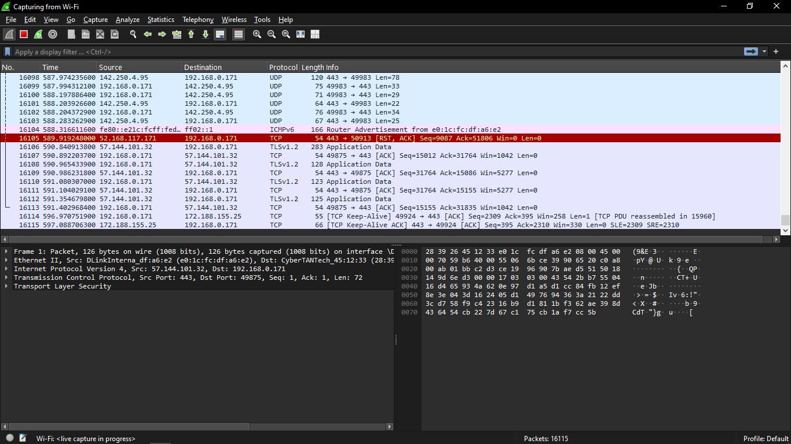
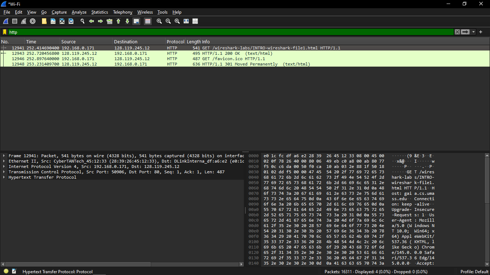
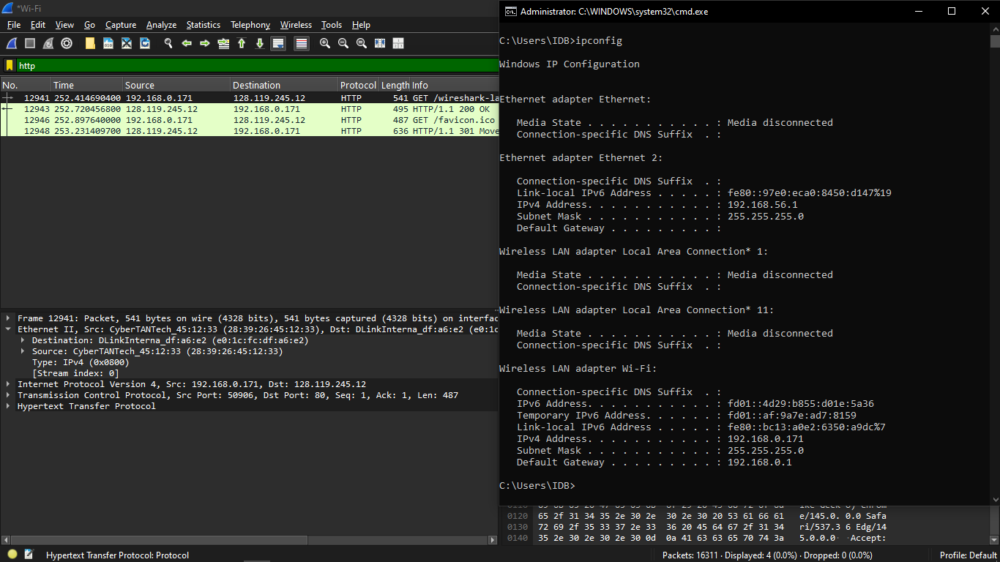

# Laporan Praktikum Jarkom Week 2

## Langkah-langkah
1. Buka Wireshark
2. Double klik "Wifi", wifi akan mencari atau mendapatkan koneksi di sekitarnya.
3. Setelah itu, klik tautan tersebut http://gaia.cs.umass.edu/wireshark-labs/INTRO-wireshark-file1.html. Reminder: Jika belum "Not secure" pastikan tautan tersebut http bukan https.
4. Jika sudah matikan / stop pencariannya.
5. Lalu cari di display filter "http", dan "GET".
6. Buka CMD ketik "ipconfig".
7. Dan lihat apakah sama Interface wifinya "IPv4".

## Lampiran
Hasil

